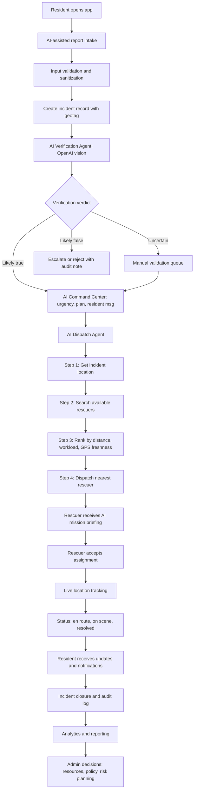

# ResQMap Overall System Flow

This flow is aligned with your Admin / PD DRRMO concept. ResQMap uses **two AI
agents** that match your flowchart:

1. **AI Verification Agent** — uses OpenAI vision to judge if a report is true.
2. **AI Dispatch Agent** — finds the nearest available rescuer by **GPS
   location** (Haversine + workload + GPS freshness). This agent is
   deterministic. It does NOT use an LLM to pick rescuers.

## End-to-End Operational Flow

## Module-to-Flow Mapping

- Resident App
  - Submit report, upload media, track status, receive alerts
- AI Verification Agent (OpenAI)
  - Conversational report intake
  - Report normalization
  - Image + context authenticity check
- AI Dispatch Agent (Deterministic)
  - GPS-based nearest-rescuer ranking
  - One-click manual or auto-dispatch
- Admin / DRRMO
  - Review AI verdict, command center plan
  - Confirm or auto-dispatch the nearest rescuer
  - Monitor municipalities and barangays
  - Review analytics and export reports
- Rescuer
  - Receive AI mission brief
  - Share real-time location
  - Progress assignment status

## AI Verification Agent (OpenAI Vision)

Purpose: determine if the reported incident is likely true using report context
and uploaded images.

Input signals:

- incident type, title, description, severity
- address and geotag location
- uploaded incident photos (up to 3 images)

AI output format:

- `verdict`: `true` | `false` | `uncertain`
- `confidence`: `0-100`
- `summary_cebuano`: brief reason in Cebuano
- `red_flags`: suspicious signals found by AI
- `recommended_action`: `verify_now` | `manual_review` | `reject_or_escalate`

## AI Dispatch Agent (Location-Based, Deterministic)

Purpose: assigning a rescuer must be based on **nearest location**, not LLM
judgment. This agent is provable, auditable, and fast.

Scoring (0.0 to 1.0, higher is better):

- **60%** inverse distance (Haversine km between incident and rescuer GPS)
- **25%** workload (fewer active assignments is better)
- **15%** GPS freshness (recent ping is better)

Candidate payload returned per rescuer:

- `rescuer_id`, `name`, `rank`
- `distance_km`, `eta_minutes` (based on 40 km/h ground response)
- `active_assignments`
- `last_seen_minutes`, `is_fresh`
- `score`

Modes:

- `Find Nearest Rescuers` — ranks top 5 and stores them on the incident.
- `Auto-dispatch Nearest` — auto-assigns rank #1 and transitions the incident
  to `dispatched` state.

## Implemented Backend Endpoints

- `POST /api/v1/incidents`
  - creates incident and returns `ai_verification`
- `POST /admin/incidents/{incident}/ai-verify`
  - re-runs OpenAI image-capable verification (AI Verification Agent)
- `POST /admin/incidents/{incident}/run-agent`
  - generates AI Command Center plan (urgency, plan, resident update)
- `POST /admin/incidents/{incident}/dispatch-agent`
  - runs AI Dispatch Agent: ranks nearest rescuers
- `POST /admin/incidents/{incident}/auto-dispatch`
  - auto-assigns the top-ranked (nearest) rescuer
- `POST /admin/incidents/{incident}/assign`
  - manual rescuer assignment (fallback)

## Governance and Controls

- role-based access via middleware (`admin`, `rescuer`, `resident`)
- Sanctum-protected API for mobile integration
- audit trail through assignment and incident status timestamps
- throttled API and AI endpoints for stability and cost control
- Dispatch decisions are **auditable**: ranking payload stored in
  `incidents.ai_dispatch` for every run.
